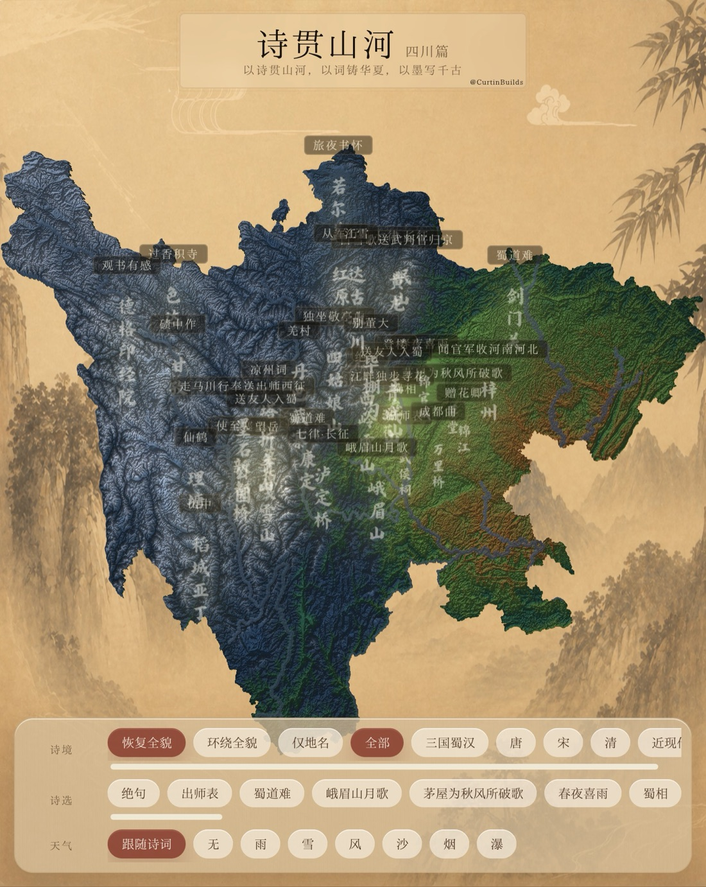
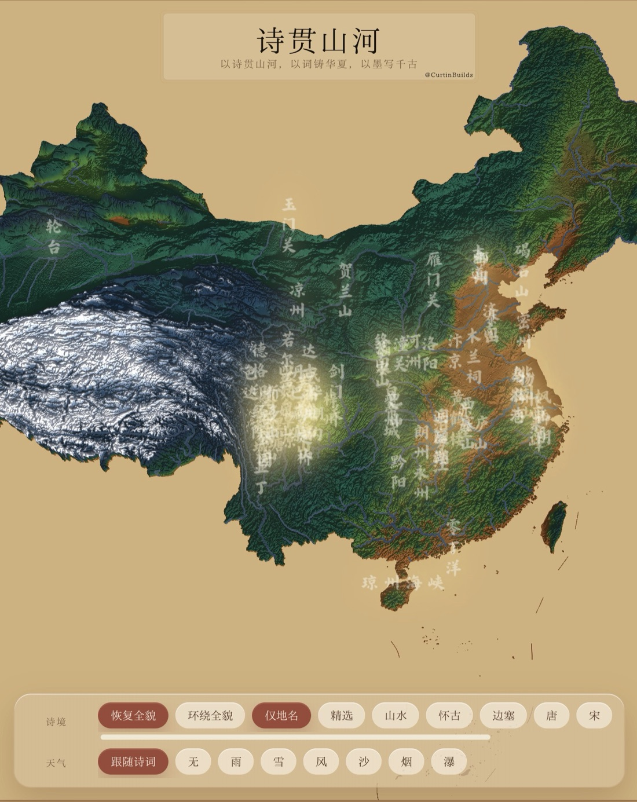

# Web Lyric

[English](./README.md)

`web-lyric` 是 `fe-lyric` Turborepo 中的主前端应用，基于 React 19、Vite 和 Three.js 实现诗词地形地图。

## 截图

<table>
  <tr>
    <td width="33.33%"></td>
    <td width="33.33%"></td>
    <td width="33.33%"></td>
  </tr>
  <tr>
    <td align="center">四川地形</td>
    <td align="center">中国总览</td>
    <td align="center">诗词详情</td>
  </tr>
</table>

## 本地开发

在仓库根目录执行：

```bash
pnpm install
pnpm dev:web-lyric
```

模块内命令：

```bash
cd apps/web-lyric
pnpm dev
pnpm build
pnpm preview
pnpm typecheck
```

## 已实现能力

- Three.js 地形渲染：位移、河流、法线光照、边缘线与色阶控制。
- EPSG:3857 投影：经纬度到地图世界坐标映射。
- 古诗点位飞行：点击后镜头聚焦并展示诗文卡片。
- 古地名层：独立于交互锚点显示。
- 局部特效：`drizzle / snowfall / windgust / sandstorm / smoke / waterfall`。
- 音频 cue：鸟鸣、风、烟、瀑布、沙声等本地音频资源。

## 目录结构

```text
apps/web-lyric/
├── public/
│   ├── audio/
│   ├── earth-map-3857/
│   ├── fonts/
│   ├── map-province-3857/
│   └── xhs-assets/
├── scripts/
│   ├── encode-heightmap-rg.mjs
│   └── generate-province-river-mask.mjs
└── src/
    ├── components/
    ├── data/
    ├── lib/
    └── map/
```

## 运行资源

主要资源路径：

- `public/earth-map-3857/heightmap_3857_rg_half.webp`
- `public/earth-map-3857/river_mask_3857_o6.png`
- `public/earth-map-3857/waternormals.jpg`
- `public/earth-map-3857/china_mask_3857.geojson`
- `public/audio/`
- `public/fonts/`

高程预处理脚本：

```bash
node --max-old-space-size=4096 scripts/encode-heightmap-rg.mjs
```

可调参数：

```bash
DILATE_ROUNDS=260 node --max-old-space-size=4096 scripts/encode-heightmap-rg.mjs
```

## 协议

项目代码遵循仓库根目录的 [MIT License](../../LICENSE)。字体、地图、高程、音频和图片等资源可能有独立授权要求。
